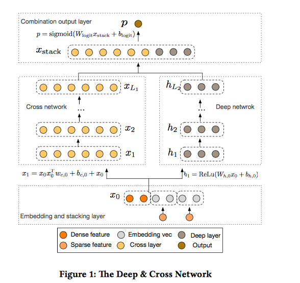
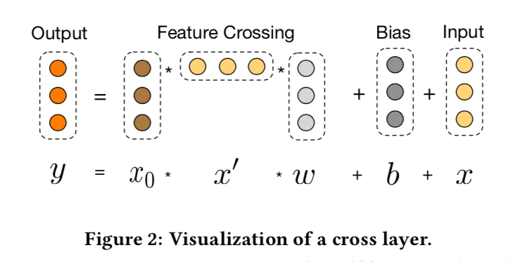

# Deep & Cross Network模型原理
## 原理
Deep&Cross Network模型结构如下图所示

该模型是从嵌入和堆积层开始，接着一个交叉网络和深度网络的并行融合结构，最后是组合层。

### 嵌入和堆叠层
为了减少独热编码带来的维数，使用嵌入过程将这些离散特征转换成实数值的稠密向量(嵌入向量):
$$x_{embed,i}=W_{embed,i}x_i$$
然后将嵌入向量与连续特征向量进行叠加组成一个向量:
$$x_0 = [x_{embed,1}^T, ..., x_{embed,k}^T, x_{dense}^T]$$
最后将$x_0$向量作为输入。

### Cross Network
交叉网络的核心思想是以有效的方式应用显式特征交叉。 
交叉网络由交叉层组成，每个层具有以下公式:
$$x_{l+1}=x_0x_l^Tw_l+b_l+x_l=f(x_l,w_l,b_l)+x_l$$

交叉网络的特殊结构使得交叉特征的程度随着层深度的增加而增大。但所有捕捉到的特征都是线性组合特征，非线性组合特征需要Deep Network来捕捉。

### Deep Network
深度网络是一个全连接的前馈神经网络，每层的输出为：
$$h_{l+1}=f(W_lh_l+b_l)$$

### Combination Layer
组合层将两个并行网络的输出连接起来，经过一层全连接层得到输出:
$$p=\sigma ([x_{L_1}^T,h_{L_2}^T]w_{logits})$$
如果采用的是对数损失函数，那么损失函数为：
$$loss=-\frac{1}{N}\sum_{i=1}^Ny_i\log(p_i)+(1-y_i)log(1-p_i)+\lambda\sum_l||w_l||^2$$

