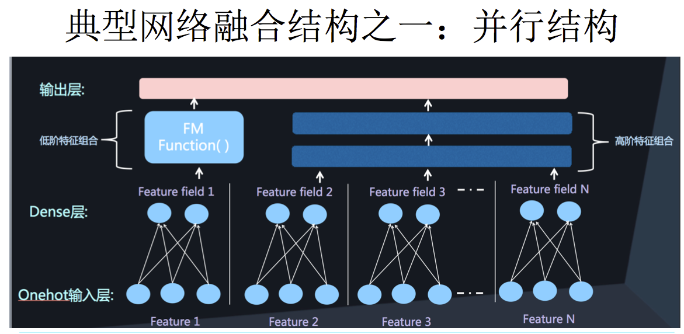

# DeepFM模型原理
## 背景
对于一个基于CTR预估的推荐系统，最重要的是学习到用户点击行为背后隐含的特征组合。在不同的推荐场景中，低阶组合特征或者高阶组合特征可能都会对最终的CTR产生影响。 
之前介绍的因子分解机(Factorization Machines, FM)通过对于每一维特征的隐变量内积来提取特征组合。最终的结果也非常好。但是，虽然理论上来讲FM可以对高阶特征组合进行建模，但实际上因为计算复杂度的原因一般都只用到了二阶特征组合。 
那么对于高阶的特征组合来说，就通过多层的神经网络即DNN去解决。
### DNN的局限
将特征转换成为one-hot的形式，但是将One-hot类型的特征输入到DNN中，会导致网络参数太多 
解决思路就是将OneHot编码进行组合，形成Dense Vector，类似于FFM中的Field思想。

再加上两层全连接层，让Dense Vector进行组合，得到高阶组合。

最后将高阶组合特征和低阶组合特征进行融合：

最常用的融合方法有两种：并行结构和串行结构

## DeepFM模型
 
DeepFM模型结构包含两个部分：神经网络部分和因子分解机部分，分别负责低阶特征的提取和高阶特征的提取。这两部分共享同样的输入。 
DeepFM的预测结构可以写成：
$$\widehat{y}=sigmoid(y_{FM}+y_{DNN})$$
### FM结构
结构的左侧为FM结构，其输出公式为：
$$y_{FM}=\langle {w,x}\rangle +\sum_{j_1=1}^d\sum_{j_2=j_1+1}^d\langle V_i,V_j\rangle x_{j_1}\cdot x_{j_2}$$
### Deep结构
结构的右侧为Deep结构，是一个前馈神经网络。由于CTR的输入一般为稀疏的。因此在第一层隐含层之前，加入嵌入层完成将输入向量压缩到低维稠密向量。 
在嵌入层中，有两个特性：
1. 尽管不同field的输入长度不同，但embedding后向量的长度均为k。
2. 在FM中得到隐变量$V_{ik}$作为了嵌入层的权重。

