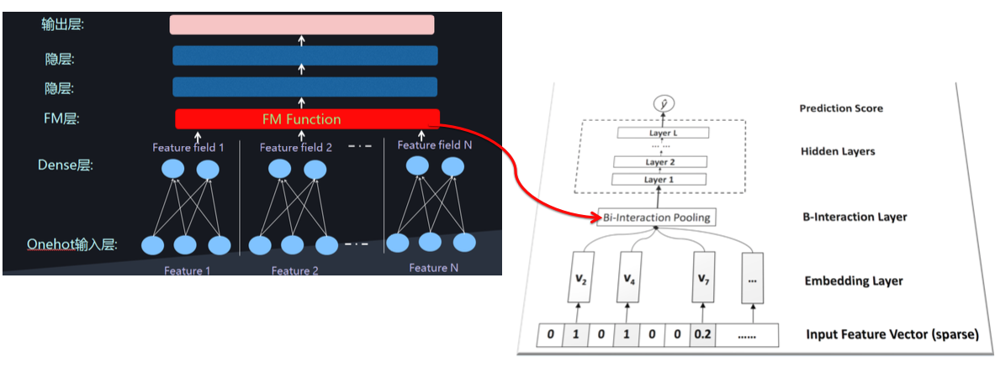

# NFM模型理论
## 引言
在CTR预估中，为了解决稀疏特征的问题，学者们提出了FM模型来建模特征之间的交互关系。但是FM模型只能表达特征之间两两组合之间的关系，无法建模两个特征之间深层次的关系或者说多个特征之间的交互关系，因此学者们通过Deep Network来建模更高阶的特征之间的关系。 
因此 FM和深度网络DNN的结合也就成为了CTR预估问题中主流的方法。有关FM和DNN的结合有两种主流的方法，并行结构和串行结构。两种结构的理解以及实现如下表所示： 

|结构|描述|常见模型|
|---|---|-------|
|并行结构|FM部分和DNN部分分开计算，只在输出层进行一次融合，得到结构|DeepFM, DCN, WDN|
|串行结构|将FM的一次项和二次项结果(或其中之一)作为DNN部分的输入，经DNN得到最终结果|PNN, NFM, AFM|

## NFM模型介绍
对于NFM，目标值的预测公式变成：
$$\widehat{y}_{NFM}(x)=w_0+\sum_{i=1}^nw_ix_i+f(x)$$
其中，f(x)是用来建模特征之间交互关系的多层前馈神经网络模块。 
Embedding Layer得到的Vector是FM中学习到的隐变量v。 
Bi-Interaction Layer其实就是计算FM的二次项过程，因此得到的向量维度就是Embedding的维度。 
$$f_{BI}(v_x)=\frac{1}{2}[(\sum_{i=1}^nx_iv_i)^2-\sum_{i=1}^n(x_iv_i)^2]$$
Hidden Layers是DNN部分，将Bi-Interaction Layer得到的结果接入多层的神经网络进行训练，从而捕捉到特征之间复杂的非线性关系。 
在进行多层训练之后，将最后一层的输出求和同时加上一项和偏置项，就得到来我们的预测输出：
$$\widehat{y}_{NFM}(x)=w_0+\sum_{i=1}^nw_ix_i+h^T\sigma_L(W_L(...\sigma_1(W_1f_{BI}(V_x)+b_1)...)+b_L)$$

