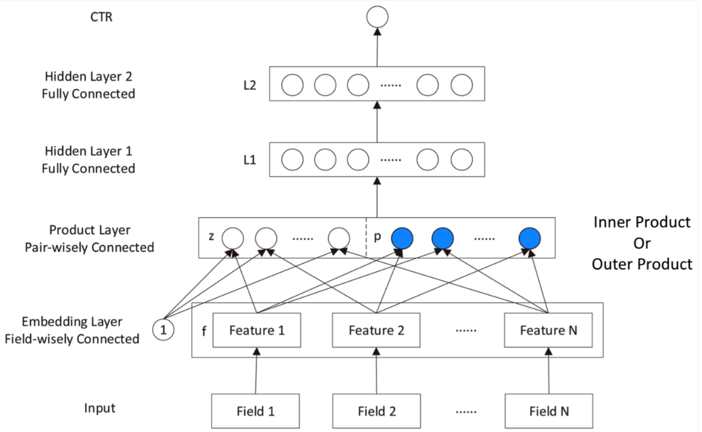
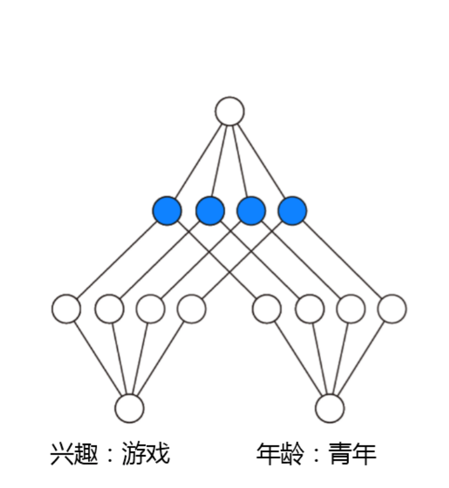
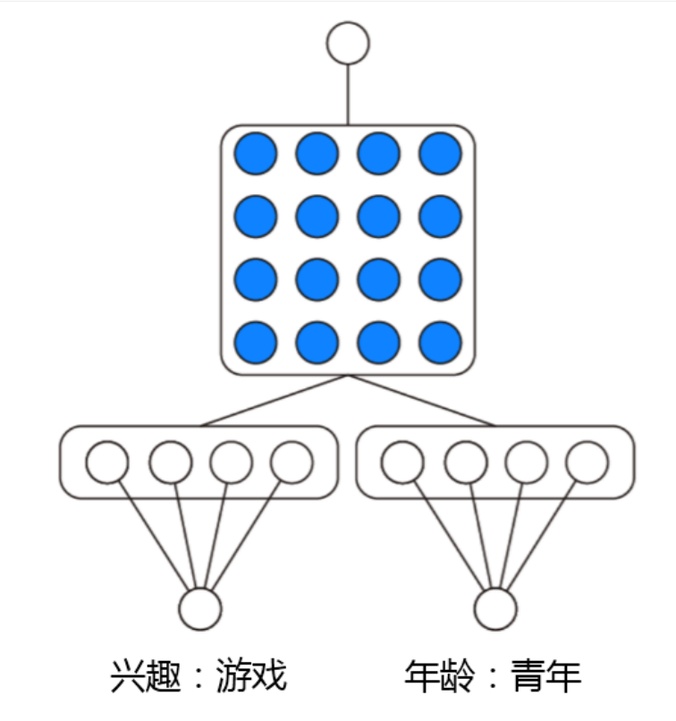

# PNN模型理论
## 原理
PNN，全称为Product-based Neural Network，认为在embedding输入到MLP之后，学习的交叉特征表达并不充分。因此提出product layer的思想，即基于乘法运算来体现特征交叉的DNN网络结构：

从上往下看这个网络：
### 输出层
输出层为一个全连接层，经过sigmoid函数转换后映射到(0,1)的区间中，得到点击率的预测值。
$$\widehat{y}=\sigma(W_3l_2+b_3)$$

### L2层
L2层也是一个全连接层，使用relu进行激活。
$$l_2=relu(W_2l_1+b_2)$$

### L1层
L1层同样是全连接层，使用relu进行激活，其输入分为三部分，分别为$l_z, l_p$。
$$l_1 = relu(l_z+l_p+b_1)$$

### Producr Layer
Product思想来源于，在CTR预估中，特征之间的关系更多是**And**关系，而不是**Add**关系。例如性别为男且喜欢游戏的人群，比起性别男和喜欢游戏的人群，前者的组合比后者更能体现特征交叉的意义。 
因此，Product Layer分为两部分：线性部分 $l_z$ 和非线性部分 $l_p$。
$$l_z = (l_z^1, l_z^2, ..., l_z^n, ..., l_z^{D1})$$
$$l_z^n=W_z^n\odot z$$
$$l_p = (l_p^1, l_p^2, ..., l_p^n, ..., l_p^{D1})$$
$$l_p^i=W_p^n\odot p$$
$$A\odot B=\sum A_{i,j}B_{i,j}$$

**线性部分$l_z$：** 
$l_z^n=W_z^n\odot z$中的z是由embedding层得到的线性信号分量，因此：
$$z=(z_1, z_2,...,z_N)=(f_1, f_2,...,f_N)$$

**非线性部分$l_p$:** 
$l_p^i=W_p^n\odot p$中的p是由f经过非线性映射得到的非线性信号分量：
$$p_{i,j}=g(f_i,f_j)$$
有两种PNN的计算方法，一种叫Inner PNN，另一种叫做Outer PNN

**1. Inner PNN**
   
   使用内积来表达$p_{ij}$:
   $$p_{ij}=g(f_i, f_j)=\langle f_i, f_j \rangle$$
   由于是通过内积得到P矩阵，因此为一个对称矩阵，那么权重W也是一个对称矩阵，稍做优化：
   $$W_p^n=\theta^n\theta^{nT}$$
   $$l_p^n=W_p^n\odot p=\sum_{i=1}^N\sum_{j=1}^N\theta_i^n\theta_j^n \langle f_i, f_j \rangle = \langle \sum_{i=1}^N \delta_i^n, \sum_{i=1}^N\delta_i^n\rangle$$
   $$\delta_i^n=\theta_i^nf_i$$
   $$l_p=(||\sum_i\sigma_i^1||,...,||\sum_i\sigma_i^n||,...,||\sum_i\sigma_i^{D1}||)$$

**2. Outer PNN**
   
   使用矩阵乘积来表达$p_{i,j}$:
   $$p_{i,j}=g(f_i, f_j)=f_if_j^T$$

### Embedding Layer
Embedding Layer跟DeepFM中相同，将每一个field的特征转换成同样长度的向量，这里用f表示。$(f_1, f_2, ..., f_N)$

### 损失函数
使用和逻辑回归相同的损失函数:
$$L(y, \widehat{y})=-y\log{\widehat{y}}-(1-y)\log(1-\widehat{y})$$

