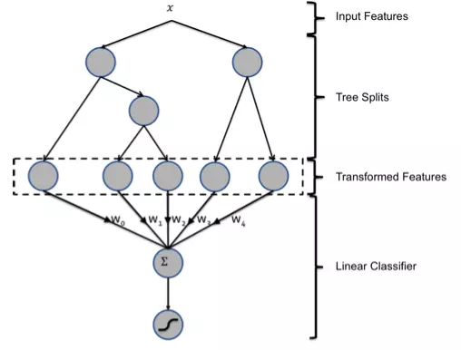

# Facebook 推荐系统 GBDT+LR
## 基本介绍
在CTR预估问题的发展初期，使用最多的方法为逻辑回归(LR)。

FM模型通过隐变量的方式，发现两两特征之间的组合关系，随后发展为DNN挖掘更高层次的特征组合关系。

GBDT是一种经常用来发现特征组合的有效思路。所以Facebook使用GBDT+LR来做这个事情。

两大问题：
1. 为什么要使用集成决策树模型，而不是两棵树的决策树模型？
   
   一棵树的表达能力太弱，不足以表达多个有区分性的特征组合。

2. 为什么使用GBDT而不是RF？
   
   GBDT为串行结构，前面的树，特征分裂主要体现对多数样本有区分度的特征。后面的树主要体现经过了前N棵树，残差依然较大的少数样本。

   ``优先选用在整体上有区分度的特征，再选用针对少数样本有区分的特征。``

## GBDT+LR的融合方案

图中共有两棵树，x为一条输入样本，遍历两棵树后，x样本分别落在两棵树的叶子节点上，每个叶子节点对应LR一维特征，通过遍历树，就得到了该样本对应的所有LR特征。构造新特征向量是取值0/1的。