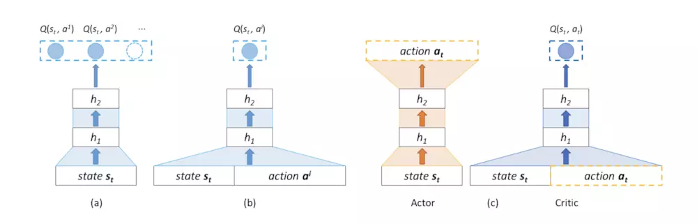
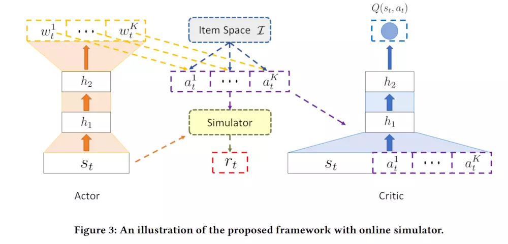

# 京东推荐系统(强化学习)
论文：《Deep Reinforcement Learning for List-wise Recommendations》2017
## 1. 基本介绍 

左边两个为DQN：
   1. (a)输入一个state，然后输出所有动作的Q值
   2. (b)输入state和具体的action，输出Q值
右边为文章所选的强化学习结构(c)：
   1. Actor-Critic结构。Actor输入一个state，输出action，然后Critic输入相应的state和Actor输出的action，得到一个Q值。Actor根据Critic的反馈更新自身的策略。

## 2. 系统框架
### 问题描述：
**本文的推荐算法基于强化学习方法，将推荐问题定义为一个马尔可夫决策过程。**

马尔可夫决策过程有五大元素：
1. 状态空间(State)
   * 状态定义为用户的历史浏览行为，即在推荐之前，用户点击或购买过的最新的N个物品。
2. 动作空间(Action)
   * 动作定义为要推荐给用户的商品列表
3. 奖励(Reward)
   * 根据当前的State，采取相应的action，根据用户对推荐列表的反馈来得到当前state-action的reward
4. 转移概率(Transition probability)
   * 针对当前的state-action，如果用户忽略了全部的商品，那么下一时刻的state和当前state是一样的，如果用户点击了其中的两个物品，那么下一时刻的state是在当前state的基础上，从前面剔除了两个商品同时将点击的这两个物品放到最后得到的。
5. 折扣因子(Discount factor)：
   * 如果折扣因子为0，说明用户只考虑当前奖励，如果折扣因子为1，说明用户考虑了未来奖励。

### 线上User-Agent交互仿真环境搭建
1. 计算当前pt(即状态动作对)和历史中(state, action)的相似性：
$$Cosine(p_t, m_i) = \alpha \frac{s_t s_i^T}{||s_t||||s_i||}+(1-\alpha \frac{a_t a_i^T}{||a_t||||a_i||})$$
2. pt获得mi对应的奖励ri的可能性定义为：
$$P(p_t->r_i) = \frac{Cosine(p_t, m_i)}{\sum_{m_j\in M}Cosine(p_t, m_j)}$$
3. 为了提高计算效率，按照奖励蓄力哦对历史记忆进行分组，来建模pt获得某个奖励序列的可能性。
 
### 模型结构

Actor:
$$f_{\theta^\pi}:s_t \Rightarrow w_t$$

$$score_i = w_t^ke_i^T$$

Critic:
$$Q(s_t, a_t) = E_{s_{t+1}}[r_t+\gamma Q(s_{t+1}, a_{t+1})|s_t,a_t]$$