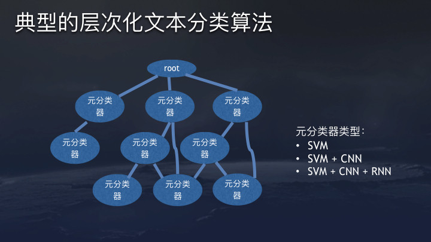
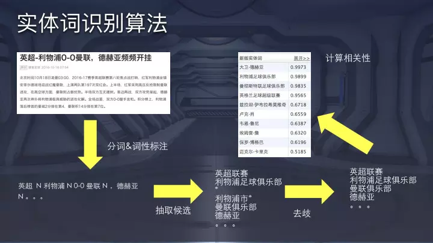

# 今日头条/抖音推荐算法(集成推荐)
## 一、系统概述
推荐系统，实质上是``拟合一个用户对内容满意度的函数，这个函数需要输入三个维度的变量：内容，用户特征，环境特征。``
1. 内容维度。
   主题词，兴趣标签，热度，时效性，质量，作者来源。
2. 用户特征维度。
   兴趣标签，职业，年龄，性别等等。**用户画像工作**
3. 环境特征。
   工作场合，旅游，位置。 

## 二、典型推荐算法
1. 协同过滤
2. Logistic 回归
3. DNN
4. Factorization Machine
5. GBDT

## 三、典型推荐特征
1. 相关性特征：评估内容的属性和与用户是否匹配。
2. 环境特征：地理位置，实践。
3. 热度特征：全局热度，分类热度，主题热度，关键词热度。``内容热度在用户冷启动的时候非常有效。``
4. 协同特征，可以在部分程度上帮助解决所谓算法越推越窄的问题。点击相似，兴趣分类相似，主题相似，兴趣词相似。

## 四、抖音大规模推荐模型的在线训练
1. 用Storm集群实时处理样本数据(点击，展现，收藏，分享)
2. 每收集一定量的用户数据就更新推荐模型。
3. 模型参数存储在高兴能服务器集群，包含几百亿原始特征和数十亿向量特征。

流程图:

线上服务器记录实时特征-->导入Kafka文件队列-->导入Storm集群-->拼接用户完整数据，构造样本-->根据最新样本更新模型参数-->线上模型获取新知识

## 五、召回策略
1. 推荐模型计算开销相对较大，完全依赖模型推荐成本过高。
2. 基于简化策略的召回模块可以有效平衡计算成本和效果。

**抖音主要使用倒排的思路。**
根据倒排的key(比如兴趣标签)，拉去相应文章进行rank top。起到实时性的推荐。

### 关于推荐系统中的数据依赖
* 推荐模型的特征抽取需要用户侧和内容测的标签。
* 召回策略需要用户侧和内容测的标签。
* ``内容分析``和``用户标签挖掘``是搭建推荐系统的基石。

## 六、内容分析
文本分析在推荐系统中的应用：
1. 用户兴趣建模：比如给喜欢阅读[互联网]文章的用户大熵[互联网]标签。
2. 帮助内容推荐：[Dota]的内容推荐给关心[Dota]的用户。
3. 生成频道内容：[德甲]的内容进入[德甲]。

### 典型层次化文本分类算法

### 实体词识别算法

## 七、用户标签
头条用户的标签：
1. 兴趣特征：
   * 感兴趣的类别和主题
   * 感兴趣的关键词
   * 感兴趣的来源
   * 基于兴趣的用户聚类
   * 各种垂直兴趣特征
2. 身份特征：
   * 性别
   * 年龄
   * 常驻地点
3. 行为特征：
   * 晚上才看视频
   * ......

数据清洗策略：
1. 过滤噪声：过滤停留时间短的点击
2. 惩罚热点：用户在热门文章上的动作做降权处理
3. 时间衰减：随着用户动作的增加，老的特征权重会随着时间衰减，新动作贡献的特征权重会更大。
4. 惩罚展现：如果一篇推荐给用户的文章没有被点击，相关特征(类别，关键词，来源)权重会被惩罚。
5. 考虑全局背景：考虑给定特征的人均点击比例(做L1 正则化)

